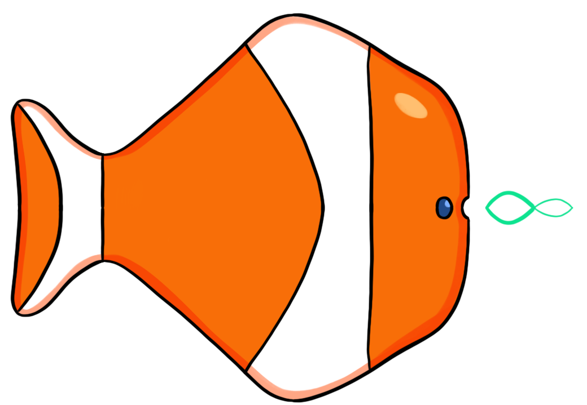

<h1  align="center">Finding Mnemo</h1>

 
<b>Less of a goldfish memory</b>

Finding Mnemo is a project dedicated to helping you learn new languages using mnemonics generated by AI models.

It relies on different methods to help you remember tricky words and ideas.

> Currently Finding Mnemo is in its prototype version and focuses on providing mnemonics for learning Mandarin words coming from English.

# Presentation

For a given Mandarin word you would want to remember, Finding Mnemo suggests close sounding words in English among a predefined list of candidates. 

It then tries to generate a key idea to help remember the pair (original word and matched word). 

## Example 

You are trying to remember the meaning of the word `努力` (`effort`).

1. Find a homophone / similar sounding word.

The word `努力` is pronounced as `nǔ lì` in Mandarin.

A good match for this sound could be the English word `newly`. 

2. Create a mnemonic Key-Phrase.

In order to create a menmonic based on that resemblance, Finding Mnemo suggest a sentence where both words, `newly` and `effort`, appear.

For example: "*It takes `effort` to settle in a `newly` discovered environment.*"

3. Create a Key-Chain.

An alternative way to remember it is to create a chain of ideas that links both words.

The word `猫咪` is pronounced `māomī`. Meaning `cat`. The closest-sounding word found in our English vocabulary would be `mommy`. 

A chain of ideas connecting both concepts could be: `cat` ⇔ `kitten` ⇔ `mother` ⇔ `mommy`.

# Demo

Find a [Streamlit demo](https://finding-mnemo.streamlit.app/) where you will be able to play with the different functionalities.

    

# Installation

Currently, the project can only be installed using its `setup.py` file, with `pip`.

# Documentation

If you want to learn more, both a user guide and technical documentation  can be found in the [Wiki Page](https://github.com/SimonPop/FindingMnemo/wiki) of the project.

