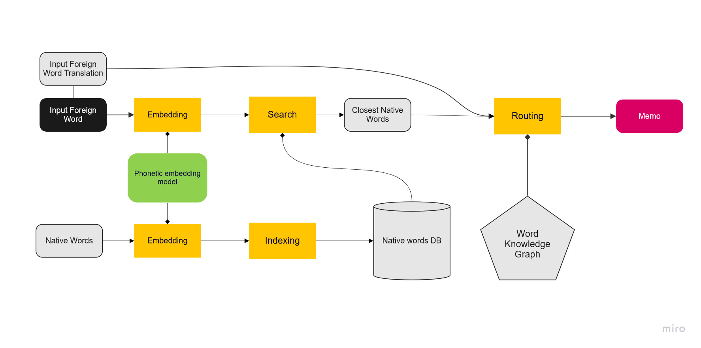

# Finding 🐠 mNemo 

This repo contains a prototype for a mnemotechnic translation generator tool.

For a given word you want to remember, finds the closest phonetic match to a known word and a link chain of ideas that allows to go from one to the other.

Issue ? 

It seems that when using **Redis** as storage and using the `match` or `find` method on a `DocumentArray` stored that way, scores that are returned are written as strings by default: 

`some_doc.match(some_docs_in_redis)`
` docs['@m','scores']` --> ... `{'score': {'value': '0.00897377729416'}}` ... 

This is a problem especially if you use that in a `Flow`. Protobuf raises an error when trying to cast them or check them.

_TypeError : Field `matches` is problematic', 'Field `scores` is problematic', "'0.00206714868546' has type str, but expected one of: int, long, float_

Is there a way to specify that scores should be float? Is there a way to bypass the type checking? 

