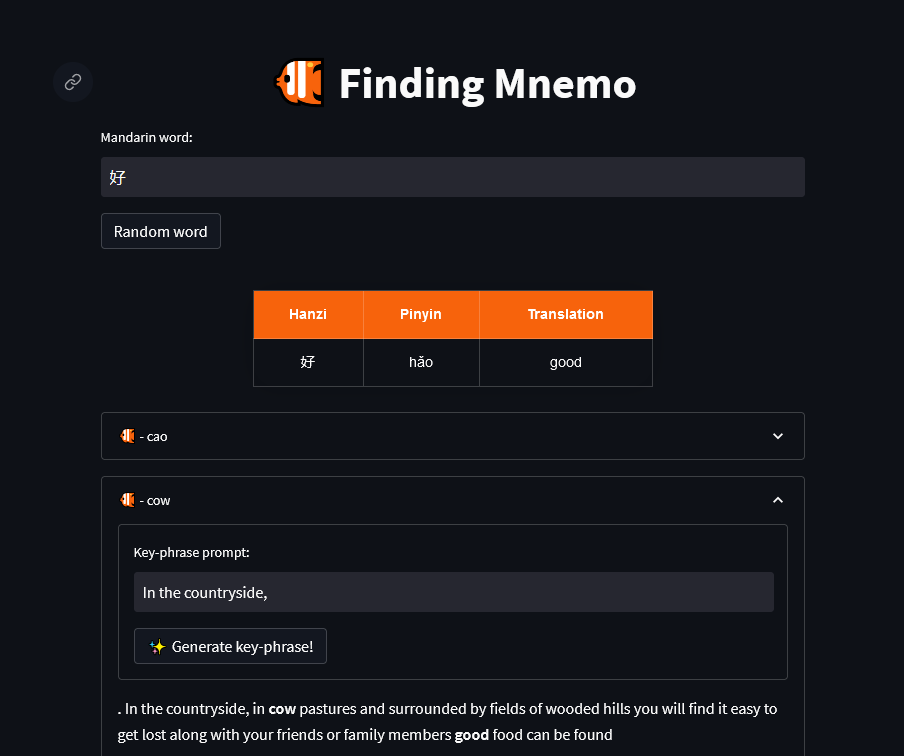
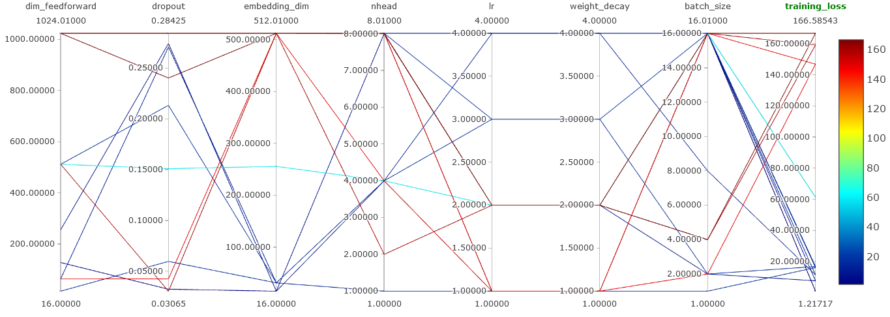

<h1  align="center">Finding Mnemo</h1>
<p align="center">

<br>
<b>Less of a goldfish memory</b>
</p>


This is a prototype for a mnemonic generator tool.

__Objective__: 
For a given word you would want to remember, finds the closest phonetic match in a predefined list of candidates. 

It also tries to generate a key idea to help remember the pair (original word and matched word). 

__Example__:
- A sentence in which both words appear.  

The word `努力` is pronounced `nǔ lì`. It means `effort`. The closest sounding word found in our English vocabulary would be `newly`. 

We then want to create a sentence that links both words such as: "*It takes `effort` to settle in a `newly` discovered environment.*"

- A chain of ideas to connect the two words

The word `猫咪` is pronounced `māomī`. Meaning `cat`. The closest-sounding word found in our English vocabulary would be `mommy`. 

We then want to create a chain that links both words such as: `cat` ⇔ `kitten` ⇔ `mother` ⇔ `mommy`.
 


## User Guide

### Deployment

The easiest way to deploy every service is through containers. 
This app requires both a Database (Redis), a backend (FastAPI) and a frontend (Streamlit).
In order to deploy all of them, we would use the `docker-compose.yaml` file using the command:
```bash
docker compose up 
```

That should pop three docker containers, which you can check on the UI or using `docker ps`.


*Docker UI after using compose-up command*

### Query

Once the docker has been popped, you can use the UI to make all your queries, as demonstrated in the following screenshot:


*Streamlit UI used for finding a mnemonic for the word: 苹果 (apple)*

## Technical Documentation

Three components are currently in development for this prototype:
- __Pairing component__: Finding an English word sounding like a given mandarin word.
- __Keyphrase component__: Generates a sentence mixing both paired words: translation of the mandarin word and sound alike word.
- __Chaining component__: Finds a chain of words connecting paired words.

### Pairing

To find a word that sounds like another, we want to use [levenshtein's distance](https://en.wikipedia.org/wiki/Levenshtein_distance) on the IPA spelling of words.

However, this distance is very computation heavy and takes prohibitive time to run over a large number of words. 

Instead, we will learn a proxy model that produces an embedding space where distances (tests have been performed on cosine distance and euclidean distance) are equivalent to levenshtein's distance.

This way, we can rely on neural search techniques to only have a single word to process at query time and to match it with already an already processed index of common words, very effectively. 

#### Pairing model

This model relies on a transformer architecture applied on [IPA characters](https://en.wikipedia.org/wiki/International_Phonetic_Alphabet). 

We use it to encode words to the embedding space discussed above and then use [euclidean distance](https://en.wikipedia.org/wiki/Euclidean_distance) to evaluate the phonetic distance between them.


*Parallel plot of model's performance in contrast with some hyperparameters*

#### Dataset

It is trained with [Triplet Loss](https://pytorch.org/docs/stable/generated/torch.nn.TripletMarginLoss.html), on a dataset generated using the original levenshtein's distance (Weak supervision).

Triplet loss works using a *margin* value, separating the anchor word and positive word from the negative word. We intend to use the knowledge of the exact distance to generate words that fit exactly or as close as possible from this margin (i.e. most relevant pairs of words).

### Search Engine

The search engine module allows matching an embedding with a list of already indexed embeddings.

It is a pretty simple `representation learning` application of [neural ranking](https://link.springer.com/article/10.1007/s10791-021-09398-0). 

The module is developped using the [DocumentArray](https://github.com/docarray/docarray) framework from [JinaAI](https://jina.ai/), a specialist in neural searching.

### Keyphrase

The first and current approach to generate a key mnemonic idea and link the pair of previously matched words is to embed them in a single sentence.

To do that, the [key-to-text](https://huggingface.co/gagan3012/k2t-base) model from HuggingFace has been tried.

Although very far from ideal, this is the current method used in the application. Occasionally making sense, often giving absurd (but sometimes effective) results.

[TODO]: Examples

### [In Development] Key-chain

In order to find a connection between two words, a first approach is to link them via a knowledge graph: find a path in that graph that links both of these words. 

#### Wikipedia roaming

We use Wikipedia as our knowledge graph: each page is a node, and link to other pages represent edges. (Wiktionary has been tried but seems less complete).


*Finding path from "Finding Nemo" to "China" through Wikipedia knowledge graph*

The fullest approach using Wikipedia as our graph would be to find one of the shortest path from a word to another. 

#### Shortest path model

In order to reduce the number of call we make to Wikipedia's API, we are looking to find the best pages to explore. That can be achieved using A* algorithm with some heuristic for distance estimation.

Machine learning model can be used to predict how far a page is from another and be used inside A* as the heuristic.

A Graph Neural Network as well as a standard ML approach have been tried.

However API calls still make the process very slow.

#### Link prediction

A less effective approach, but faster one is simply to start with a finite graph (e.g. a graph for all english words of our vocabulary) and simply find the word in the graph our input word is the closest from, and then compute the path in that graph to our final word instead of roaming Wikipedia to find the optimal path.


*Finding path from "Elephant" to "China" through restricted Wikipedia knowledge graph*

#### Link prediction model

🐠 In Progress 🐠


